<p align="center">
  <picture>
    <source media="(prefers-color-scheme: dark)" srcset="brand/mcpmaster-logo-dark.svg">
    
  </picture>
</p>

<h1 align="center">mcpmaster</h1>

<p align="center"><b>Connect your agents to anything.</b><br>
One local MCP endpoint for every API and MCP server you use, with a web UI to manage them.</p>

<p align="center">
  <a href="https://www.npmjs.com/package/mcpmaster"></a>
  <a href="LICENSE"></a>
  
  <a href="https://mcpmastersh.github.io/mcpmaster/"></a>
  <a href="https://mcpmaster.sh/"></a>
</p>

<p align="center"><sub>Works with &nbsp;  Claude Code &nbsp;·&nbsp;  Codex &nbsp;·&nbsp;  Cursor &nbsp;·&nbsp;  Claude Desktop &nbsp;·&nbsp;  VS Code &nbsp;·&nbsp;  Windsurf &nbsp;·&nbsp;  OpenCode &nbsp;·&nbsp;  Streamable HTTP</sub></p>

<picture>
  <source media="(prefers-color-scheme: dark)" srcset="docs/mcpmaster-ui-dark.svg">
  
</picture>

---

Paste an OpenAPI spec, a GraphQL endpoint, a remote MCP server or the command
for a local one. mcpmaster turns each into tools and serves all of them to
Claude, Cursor, Codex, VS Code and any other MCP client through **one**
connection. Integrations you add later show up in agents that are already
connected. You don't reconfigure anything.

**One tool, not a thousand.** By default an agent sees a single `execute`
tool, whatever you connect. It writes a short snippet that finds the tools it
needs, calls them and returns only the part of the result it wants. Three
large APIs can add up to well over a thousand tool schemas, and none of them
land in the agent's context up front.

<table>
  <tr>
    <td width="33%" valign="top"><b>🔌 One endpoint</b><br>OpenAPI, GraphQL, remote MCP servers and local stdio commands, all behind one connection.</td>
    <td width="33%" valign="top"><b>🧠 One tool, not a thousand</b><br>Agents see a single <code>execute</code> tool: ~515 tokens instead of ~401,000.</td>
    <td width="33%" valign="top"><b>🧪 Sandboxed code mode</b><br>Snippets run in QuickJS (WebAssembly) with no network, filesystem or host access.</td>
  </tr>
  <tr>
    <td valign="top"><b>🛡️ Guardrails</b><br>Block rules, read-only and review apply on every listing and call, even to tools that don't exist yet.</td>
    <td valign="top"><b>🔐 Keys never shown</b><br>Credentials are used, never displayed, and stripped from any response that echoes them.</td>
    <td valign="top"><b>🖥️ Fast web UI</b><br>Browse thousands of tools, run them with your own arguments and try snippets the way an agent writes them.</td>
  </tr>
</table>

## Contents

- [📦 Install](#install)
- [🤖 Connect your agent](#connect-your-agent)
- [🔌 Add integrations](#add-integrations)
- [🧠 How agents call your tools](#how-agents-call-your-tools)
- [🛡️ Control what agents can reach](#control-what-agents-can-reach)
- [⌨️ Use it](#use-it)
- [🔐 Security](#security)
- [🗝️ Pairs with mcpv](#pairs-with-mcpv)
- [☁️ mcpmaster Cloud](#mcpmaster-cloud)
- [⬆️ Upgrade](#upgrade)
- [🩺 Troubleshooting](#troubleshooting)
- [❓ FAQ](#faq)
- [🛠️ Develop](#develop)

<a id="install"></a>

## 📦 Install

```sh
curl -fsSL https://raw.githubusercontent.com/mcpmastersh/mcpmaster/main/install.sh | sh
```

This installs one file, starts mcpmaster in the background and opens the web
UI. Requires Node.js 20+. Prefer npm? Use `npm i -g mcpmaster`, or skip the
install entirely with `npx mcpmaster up`.

<a id="connect-your-agent"></a>

## 🤖 Connect your agent

**Easiest: let your agent do it.** Paste this into Claude Code, Codex, Cursor or
any coding agent:

```text
Set up mcpmaster so every tool I use is behind one MCP endpoint.

1. Install it (needs Node 20+; no sudo):
   curl -fsSL https://raw.githubusercontent.com/mcpmastersh/mcpmaster/main/install.sh | MCPMASTER_SKILL=1 sh
2. Run `mcpmaster status`, then `mcpmaster connect` and apply the snippet for my client
   (for Claude Code: `mcpmaster connect claude-code | sh`).
3. Read the skill it saved (~/.claude/skills/mcpmaster/SKILL.md) or run `mcpmaster help`.
4. Ask me which API, GraphQL endpoint or MCP server to add first, then `mcpmaster add <url> --name <slug>`
   and show me `mcpmaster list`.

Rules:
- Pass credentials by variable name (--token-env) or stdin (--token-stdin). Never as an argument, never ask me to paste one here.
- The endpoint advertises one `execute` tool on purpose. Do not try to list every tool instead.
- Do not turn on private-network access without asking me and saying why.
- Do not guess flags. Run `mcpmaster --help` and use what it lists.
- If a step fails, quote what it printed and give me the next thing to try.
```

**Agent skill.** [`skills/mcpmaster/SKILL.md`](skills/mcpmaster/SKILL.md) is the
standing guide an agent keeps: the one-endpoint model, code mode, credentials
and the commands. Claude Code loads it on demand from
`~/.claude/skills/mcpmaster/`. Save it with `MCPMASTER_SKILL=1` on the
installer, or copy the file. For other agents, append it to your `AGENTS.md`.

Or connect by hand:

| Agent | One line |
| --- | --- |
| Claude Code | `claude mcp add mcpmaster -- npx -y mcpmaster@latest mcp` |
| Codex | `codex mcp add mcpmaster -- npx -y mcpmaster@latest mcp` |
| Cursor / Claude Desktop / Windsurf | `{"mcpServers":{"mcpmaster":{"command":"npx","args":["-y","mcpmaster@latest","mcp"]}}}` |
| VS Code | `{"servers":{"mcpmaster":{"type":"stdio","command":"npx","args":["-y","mcpmaster@latest","mcp"]}}}` |
| Anything else | Streamable HTTP at `http://127.0.0.1:7437/mcp` with `Authorization: Bearer $(mcpmaster token)` |

`mcpmaster connect` prints all of these. `mcpmaster connect claude-code | sh`
runs the Claude Code one.

<a id="add-integrations"></a>

## 🔌 Add integrations

In the web UI (`mcpmaster up`), paste anything into the box. From the terminal:

```sh
# OpenAPI 3 — JSON or YAML, URL or local file
mcpmaster add https://petstore3.swagger.io/api/v3/openapi.json
mcpmaster add ./openapi.yaml

# GraphQL — queries and mutations become tools
mcpmaster add https://countries.trevorblades.com/graphql

# Remote MCP server — OAuth sign-in opens in your browser when it needs one
mcpmaster add https://mcp.example.com/mcp

# Local MCP server — any command that speaks MCP over stdio
mcpmaster add -- npx -y @modelcontextprotocol/server-filesystem ~/code

# Credentials: never on the command line
mcpmaster add https://api.github.com/openapi.json --bearer --token-env GITHUB_TOKEN
printf %s "$KEY" | mcpmaster add https://api.example.com/spec.json --api-key=X-Api-Key --token-stdin
mcpmaster add --env API_KEY=… -- npx -y some-mcp-server
```

<details>
<summary><b>🔑 OAuth2 with your own client</b></summary>

For an API that wants OAuth2 with an app you registered on the provider
(GitHub, Google, Atlassian, Salesforce, your own IdP…), give mcpmaster the
client. mcpmaster finds the provider's endpoints from what it publishes: RFC 8414
authorization server metadata, OpenID Connect discovery, or an RFC 9728
protected resource naming its authorization server. It looks at the
integration's URL first, or at `--issuer` if you pass one. Only a provider that
publishes nothing needs `--token-url` (and `--authorize-url`) by hand.

A browser sign-in doesn't need an OAuth app of your own when the provider
supports dynamic client registration (RFC 7591, a `registration_endpoint` in
its metadata). With no `--client-id`, mcpmaster registers itself at sign-in as
a public PKCE client with this machine's callback as its redirect URI, and
reuses that registration after that. Pass `--client-id` to use your own app
instead.

When the provider has a sign-in page it's a browser sign-in (authorization code
with PKCE), and your browser opens to its consent screen. `--grant
client_credentials` (or a bare `--token-url`) is machine-to-machine, with no
sign-in. A browser sign-in needs `--type`, because there's no token to look at
the URL with until after it's added.

```sh
# Browser sign-in, endpoints discovered from the issuer. Register
# http://127.0.0.1:7437/oauth/callback as the redirect URI on your OAuth app
# (mcpmaster prints it too).
mcpmaster add https://api.example.com/openapi.json --type openapi --oauth2 \
  --issuer https://auth.example.com \
  --client-id "$CLIENT_ID" --client-secret-env CLIENT_SECRET --scope "read write"

# Client credentials (machine-to-machine), endpoints given by hand
mcpmaster add https://api.example.com/graphql --type graphql --oauth2 \
  --token-url https://auth.example.com/oauth/token \
  --client-id "$CLIENT_ID" --client-secret-env CLIENT_SECRET
```

Tokens are refreshed on their own. If the provider revokes one, mcpmaster
gets a new one and retries the call once. When the grant itself is gone,
`mcpmaster login <name>` runs the consent again. A public client (PKCE with
no secret) works too: leave out the secret. `--client-auth basic` sends the
client as HTTP Basic for providers that require it. The web UI has the same
settings under **Authentication → OAuth2**. It looks up the endpoints as soon as
you pick OAuth2, and shows the fields only when the provider publishes nothing.

mcpmaster works out what you pasted. Pass `--type openapi|graphql|mcp|stdio`
to skip detection. Each integration gets a short name (`--name` to choose it).
That name becomes its tool prefix, so agents see `github_list_repos`,
`countries_country` and so on.

</details>

<a id="how-agents-call-your-tools"></a>

## 🧠 How agents call your tools

| | Every schema up front | mcpmaster, default mode |
| --- | --- | --- |
| Tools in context | 1,600+ definitions | 1 `execute` tool |
| Tokens before the first message | ~401,000 | ~515 |
| New integrations | Reconnect or reload | Show up in agents already connected |

By default (`mcpmaster settings tools execute`), agents get one `execute` tool.
Its description lists your integrations, and the agent's code does the rest:

```ts
const { items } = await tools.search({ query: "open issues" });
const path = items[0].path;                       // e.g. "github_list_issues"
const { inputSchema } = await tools.describe.tool({ path });
const issues = await tools[path]({ repo: "acme/api", state: "open" });
return issues.map((i) => ({ title: i.title, url: i.html_url }));   // only this goes back
```

Snippets run in a QuickJS sandbox compiled to WebAssembly. They can't reach
the network, the filesystem or the host process, only your tools. Every call
they make goes through the same egress checks, credential handling and
redaction as a direct call. They're also bounded in time (30 s), memory,
number of tool calls and result size. TypeScript works on Node 22.13+; older
Node versions run plain JavaScript.

To list every tool individually instead, for a client that can't run code,
use `mcpmaster settings tools all`. You can also set `MCPMASTER_TOOL_MODE=all`
for a single agent's process. Direct calls by full name work in both modes.

<a id="control-what-agents-can-reach"></a>

## 🛡️ Control what agents can reach

```sh
mcpmaster tools block github_delete_repo       # one tool
mcpmaster tools block 'github_delete_*'        # a rule: * any run, ? one character
mcpmaster tools unblock github_delete_branch   # allow one tool over a rule
mcpmaster policy github --read-only            # only GET / queries / read-only MCP tools
mcpmaster policy github --hide-new-tools       # tools from future syncs wait for review
mcpmaster policy github --approve              # expose the ones waiting
mcpmaster tools rules                          # everything in effect
mcpmaster tools --blocked                      # what's hidden, and why
```

Rules, read-only and review are evaluated on every listing and every call, not
applied once. That means they also cover tools an API adds later: a
`github_delete_*` rule hides a delete endpoint that doesn't exist yet as soon
as a sync brings it in. Precedence, strongest first:

1. a tool you switched on
2. a tool you switched off
3. new, not yet reviewed
4. read-only
5. a rule

A hidden tool is gone for agents. It isn't listed, `tools.search` in code mode
won't find it, and a direct call by name is refused. Read-only is decided from
what each integration declares: the HTTP method for OpenAPI, query vs.
mutation for GraphQL, and the tool's own `readOnlyHint` for MCP. An MCP tool
without that annotation counts as a write.

The web UI has the same controls: switches per tool, block rules with a live
match count on the Tools page, and read-only and review switches on each
integration.

<a id="use-it"></a>

## ⌨️ Use it

```sh
mcpmaster tools              # tools, 50 at a time (--offset n, --limit n, --all)
mcpmaster tools weather      # search by name or description
mcpmaster tools --integration github --access write --hidden   # filter
mcpmaster call countries_country '{"code":"DE"}'   # result on stdout, pipe it to jq
mcpmaster execute 'return await tools.search({ query: "country" })'   # exactly what an agent runs
mcpmaster list               # integrations and their status
mcpmaster sync [name]        # re-read tools after an API changes
mcpmaster disable <name>     # hide an integration from agents without deleting it
mcpmaster tools block <tool | rule>                # see "Control what agents can reach"
mcpmaster login <name>       # sign in again: an OAuth MCP server (always from scratch) or an --oauth2 integration
mcpmaster remove <name>      # delete it, its tools and its credential
```

The web UI does all of this too. Its tool browser stays fast with thousands of
tools: search and filters (integration, reads/writes, exposed/hidden) run on
the server, the list loads 50 rows at a time, and a tool's parameters load only
when you open it. You can select every tool matching a filter and hide or
expose them in one go, run any tool with your own arguments, and try snippets
the way an agent writes them. The connect snippets for each agent are there
too.

<a id="security"></a>

## 🔐 Security

mcpmaster runs on your machine, and it's built on the assumption that a web
page in your browser may be hostile:

- **Loopback only.** The server binds to `127.0.0.1` and rejects any other
  `Host` header, which blocks DNS rebinding.
- **Token on every call.** The web UI's API and the HTTP MCP endpoint both
  require your local token (`~/.mcpmaster/token`). The UI receives it through
  the URL fragment, which is never sent to a server. Cross-origin and non-JSON
  writes are refused, and the page runs under a strict CSP.
- **Credentials are used but never shown.** They're stored in
  `~/.mcpmaster/secrets.json` (owner-only permissions) or read from an
  environment variable, and the UI and CLI never display them. If an API
  echoes a credential back in a response, mcpmaster removes it before your
  agent sees the response.
- **Safe outbound calls.** Every request to an integration goes through a
  single egress path. That path pins the DNS answer it validated, never
  follows redirects, and enforces a timeout and a response-size cap.
  Private and loopback addresses are blocked until you run
  `mcpmaster settings private-network on`, which you'd do to wrap an API on
  localhost or your LAN.
- **OAuth never reuses a stale client.** OAuth state for a remote MCP server
  is stored per integration, never per URL. That covers the dynamically
  registered client, its tokens and the PKCE verifier. Every sign-in registers
  a new client, and removing or signing out of an integration deletes all of
  it. If the provider rejects the client or revokes the token, that state is
  dropped as well.
- **OAuth2 consent stays on this machine.** The provider redirects back to
  `127.0.0.1`, and the callback is accepted only with the single-use `state`
  mcpmaster issued for that sign-in in the last 10 minutes. PKCE is always
  used. Token and authorization URLs must be https (plain http only to
  localhost), token requests go through the same egress path as everything
  else, and a provider's error body is never passed on. The client secret,
  access and refresh tokens live in `secrets.json`. They're never shown, and
  they're removed from any response that echoes them.

<a id="pairs-with-mcpv"></a>

## 🗝️ Pairs with mcpv

Keep the keys out of the chat, too. [**mcpv**](https://github.com/mcpmastersh/mcpv) is the offline, encrypted vault
for the secrets your app needs. Your `.env` holds `mcpm://` addresses, not values, and your agent runs the app
without ever reading a key.

```bash
DATABASE_URL=mcpm://acme/api/dev/DATABASE_URL
STRIPE_KEY=mcpm://acme/api/dev/STRIPE_KEY

$ mcpv run -- npm run dev
  connected to postgres://app:[redacted]@db
```

<a id="mcpmaster-cloud"></a>

## ☁️ mcpmaster Cloud

| **Self-hosted** | **Cloud** |
| --- | --- |
| Free, Apache-2.0. Runs on your machine. | 14-day trial. Hosted at [mcpmaster.sh](https://mcpmaster.sh/). Nothing to install. |
| ✅ Unified MCP endpoint | ✅ Hosted endpoint for every agent |
| ✅ Code mode, guardrails, web UI | ✅ Workspaces, team roles, private workspaces behind OAuth |
| ✅ Secret vault with [mcpv](https://github.com/mcpmastersh/mcpv) | ✅ Agent Secrets, same `mcpm://` format as mcpv |
| — Team roles and workspaces | ✅ Website crawling and a chat widget |
| — Audit trail and instant revocation | ✅ Audit trail and instant access revocation |

This is the open-source, self-hosted core of [mcpmaster](https://mcpmaster.sh/).
Cloud runs the same integration engine
([`@mcpmaster/core`](packages/core): translation, dispatch, egress, redaction).
On top of it Cloud adds a hosted endpoint, workspaces with team access
control, private workspaces behind OAuth, Agent Secrets, website crawling, a
chat widget, and an audit trail.

**Can I mix Cloud and self-hosted?** Yes, in either direction:

- An agent can connect to more than one mcpmaster: your local one and a Cloud
  workspace (`https://mcpmaster.sh/api/mcp/<workspace>`).
- A Cloud workspace can also be added to your local mcpmaster as a remote MCP
  integration. Private workspaces use the same OAuth sign-in as any other MCP
  server.

<a id="upgrade"></a>

## ⬆️ Upgrade

Run the installer again. It fetches the newest version straight from the npm
registry (so a stale npm cache can't hold you back), restarts the background
server and keeps your integrations and credentials.

```sh
curl -fsSL https://raw.githubusercontent.com/mcpmastersh/mcpmaster/main/install.sh | sh
mcpmaster --version
```

Already installed? The command does the same thing:

```sh
mcpmaster update           # install the newest version
mcpmaster update --check   # only say whether one is available
```

Installed with npm? Use `npm i -g mcpmaster@latest --prefer-online`, then
`mcpmaster stop && mcpmaster up`: a server started by the old version keeps
running the old code. `npm update -g` takes package names only
(`npm update -g mcpmaster`); to pick a version use `npm i -g mcpmaster@0.3.1`.

<a id="troubleshooting"></a>

## 🩺 Troubleshooting

<details>
<summary><b><code>npm i -g mcpmaster</code> fails with <code>EEXIST: file already exists</code></b></summary>

```
npm error code EEXIST
npm error path /Users/you/.local/bin/mcpmaster
npm error File exists: /Users/you/.local/bin/mcpmaster
```

The one-line installer already put a `mcpmaster` command at that path, and npm
refuses to overwrite a file it didn't create. You don't need npm: run
`mcpmaster update`, or the installer again. To move to the npm copy instead,
remove the installer's file first:

```sh
rm ~/.local/bin/mcpmaster
npm i -g mcpmaster@latest --prefer-online
```

`--force` also works, but overwrites the file without asking. Your integrations
and credentials live in `~/.mcpmaster` and are not touched either way.

</details>

<details>
<summary><b><code>npm update -g mcpmaster</code> says "up to date" but the version is old</b></summary>

npm answers from cached registry data, or updated a different copy than the
one that runs. Check, then bypass the cache:

```sh
mcpmaster --version                # what actually runs
which -a mcpmaster                 # every copy on your PATH, in order
npm i -g mcpmaster@latest --prefer-online
mcpmaster update                   # or skip npm entirely
```

Still stale? `npm cache clean --force`. `npx mcpmaster …` keeps a separate
cache: use `npx --yes mcpmaster@latest --version`, or `rm -rf ~/.npm/_npx`.

</details>

<details>
<summary><b>The version changed but the web UI looks the same</b></summary>

The background server keeps running the code it started with. Restart it:
`mcpmaster stop && mcpmaster up`.

</details>

<a id="faq"></a>

## ❓ FAQ

<details>
<summary><b>What is mcpmaster?</b></summary>

A local MCP server that wraps every API and MCP server you use and serves them all through one connection. Add an OpenAPI spec, a GraphQL endpoint, a remote MCP server or a local stdio command, and every connected agent can use it.

</details>

<details>
<summary><b>Why only one <code>execute</code> tool?</b></summary>

Loading every schema up front can cost hundreds of thousands of tokens. With code mode the agent searches for tools and returns only what it needs. If your client can't run code, `mcpmaster settings tools all` lists every tool individually.

</details>

<details>
<summary><b>Where are my credentials stored?</b></summary>

In `~/.mcpmaster/secrets.json` with owner-only permissions, or read from an environment variable. The CLI and UI never display them, and they're stripped from any response that echoes them. Pass them with `--token-env` or `--token-stdin`, never as an argument.

</details>

<details>
<summary><b>How is this different from mcpmaster Cloud?</b></summary>

Self-hosted is the open-source core. Cloud runs the same engine and adds a hosted endpoint, team workspaces, private workspaces behind OAuth, Agent Secrets, crawling, a chat widget and an audit trail. You can use both at once.

</details>

<a id="develop"></a>

## 🛠️ Develop

```sh
git clone https://github.com/mcpmastersh/mcpmaster && cd mcpmaster
npm install
npm run build --workspace packages/mcpmaster     # → packages/mcpmaster/dist/mcpmaster.mjs
node packages/mcpmaster/dist/mcpmaster.mjs up
npm test
```

State lives in `~/.mcpmaster`. Set `MCPMASTER_HOME` to use a different
directory.

## Brand

Logo files, PNG exports and usage notes are in [`brand/`](brand/).

## License

[Apache-2.0](LICENSE)

<p align="center"><sub>Give your agent every tool. Keep every key.</sub></p>
